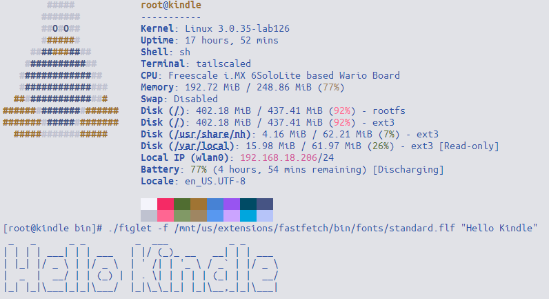
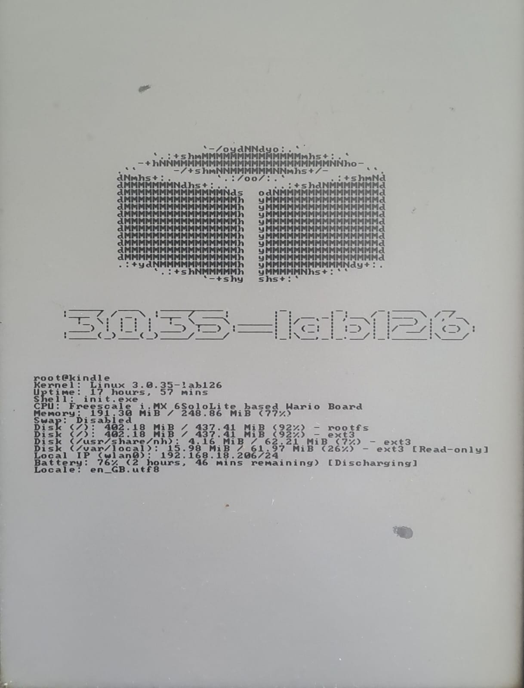

# Kual-fastfetch v1.0.3
A small extension with precompiled binaries for fastfetch and figlet with no dependencies required

## Customisation
- Editing the ascii_art.txt will allow you to use any ascii art you want
- You can change the font used by changing the .flf on line 63 in "fetcher.sh"

## Terminal output

## Eink display

